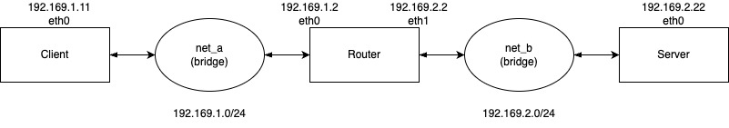
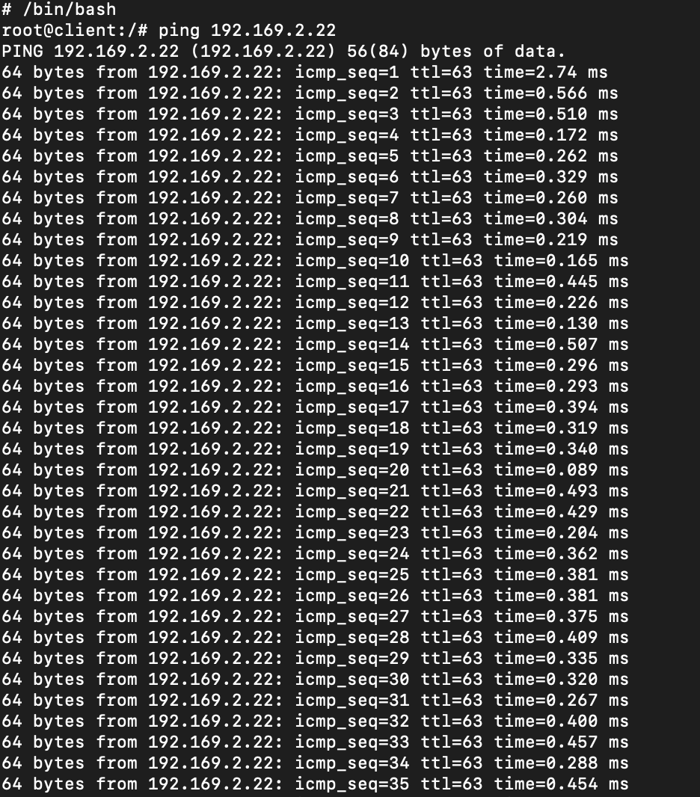
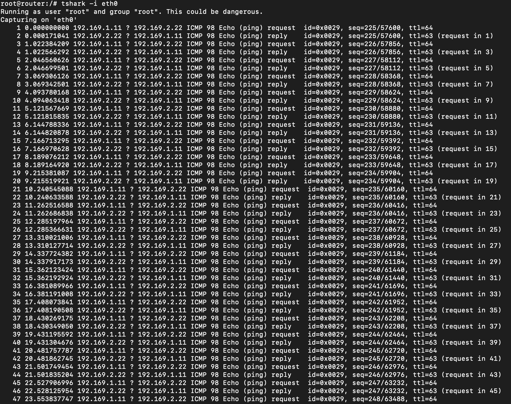

# Reti 1 networking playground

## Building an internal network in Docker

### Introduction

This project is a playground for the Reti di elaboratori course at the University of Turin.

The goal is to build an internal network in Docker, with a router, a client and a server.



eth0 is our interface but every operating system has a different name for it. In this case, we are using Ubuntu 16.04.

### Create a docker-compose.yml file

The first step is to create a docker-compose.yml file, which will be used to build the network.

The file is composed by:

- three services: router, client and server.
- two network: net-a and net-b

### Networks

The networks are created with a [bridge driver](https://docs.docker.com/network/bridge/), which allows the containers to communicate with each other, and a subnet.

```yml
networks:
  net-a:
    name: net-a
    driver: bridge
    ipam:
      config:
        - subnet: 192.169.1.0/24
  net-b:
    name: net-b
    driver: bridge
    ipam:
      config:
        - subnet: 192.169.2.0/24
```

### Services

#### Client and Server

The client is a simple container with a Dockerfile, which will be used to send a request to the server.

```yml
client:
  build:
    context: "./"
    dockerfile: "Dockerfile-host.custom"
  container_name: client
  hostname: client
  tty: true
  cap_add:
    - "ALL"
  networks:
    net-a:
      ipv4_address: 192.169.1.11
  command: bash -c "route add -net 192.169.0.0 netmask 255.255.0.0 gw 192.169.1.2 dev eth0 && /bin/bash"

server:
  build:
    context: "./"
    dockerfile: "Dockerfile-host.custom"
  container_name: server
  hostname: server
  tty: true
  cap_add:
    - ALL
  networks:
    net-b:
      ipv4_address: 192.169.2.22
  command: bash -c "route add -net 192.169.0.0 netmask 255.255.0.0 gw 192.169.2.2 dev eth0 && /bin/bash"
```

We specified:

- tty: true, to keep the container running
- cap_add: ALL, to add all the capabilities to the container. This is needed to run the route command
- networks: to specify the network in which the container will be connected and we specified the ip address
- command: to add the route to the network because the container doesn't know the network in which it is connected and we need to specify the gateway to which to send packets whose destination is not in the client's local network, and the device to use to reach the network.

#### Router

The router is a container with a Dockerfile, which will be used to route the traffic between the two networks.

```yml
router:
  build:
    context: "./"
    dockerfile: "Dockerfile-router.custom"
  container_name: router
  hostname: router
  tty: true
  cap_add:
    - ALL
  networks:
    net-a:
      ipv4_address: 192.169.1.2
    net-b:
      ipv4_address: 192.169.2.2
  command: bash -c "sysctl -w net.ipv4.ip_forward=1 && sysctl -p /etc/sysctl.conf && /bin/bash"
```

We specified:

- command to enable the ip forwarding:
  `sysctl -w net.ipv4.ip_forward=1 && sysctl -p /etc/sysctl.conf`

#### TEST

To test the network, we can run the following commands:

From client:

```bash
ping 192.168.2.22
```



From router:
We installed wireshark and tshark to capture the packets.

```bash
tshark -i eth0
```



# Contributors

Andrea Fulcheri and Matteo Marengo
22/10/2022
